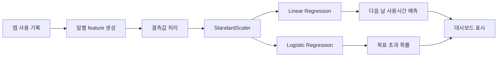

# HabitGuard

스마트폰 사용 기록을 로컬에서 수집하고, 다음 날 스크린타임과 목표 초과 위험을 예측한 뒤, 사용자가 직접 승인한 제한 규칙과 미션 화면으로 사용 습관 개선을 돕는 Android 프로젝트입니다.

> 핵심 주의: 현재 공개된 AI 모델 성능은 `source_type=synthetic`, `evaluation_scope=synthetic evaluation` 기준입니다. 실제 기기 사용 기록은 예측 입력으로 사용할 수 있지만, 현재 수치를 실제 사용자 성능으로 주장하면 안 됩니다.


## 프로젝트 바로가기

| 문서 | 설명 |
| --- | --- |
| [Android 앱 README](habitguard_android/README.md) | 앱 기능, 화면, AI 파이프라인, 빌드 방법 요약 |
| [프로젝트 보고서](habitguard_android/docs/HABITGUARD_REPORT.md) | 인포그래픽, 모델 구조, 혼동 행렬 분석, 개인정보 원칙 |
| [프로젝트 감사](habitguard_android/PROJECT_AUDIT.md) | 실제 구현 상태와 근거 |
| [포스터 주장 정리](habitguard_android/POSTER_CLAIMS.md) | 발표에 써도 되는 말과 쓰면 안 되는 말 |
| [기술 리스크](habitguard_android/TECH_RISKS.md) | Android 권한, 개인정보, 모델 신뢰성 리스크 |
| [데이터 사전](habitguard_android/DATA_DICTIONARY.md) | CSV export와 local inference bundle 필드 |

## 한 줄 요약

HabitGuard는 서버 없이도 동작하는 local-first Android 앱입니다.

- Android `UsageStatsManager`로 앱별 사용 기록을 수집합니다.
- Room DB에 일별 사용 요약과 예측 결과를 저장합니다.
- Python에서 학습한 Linear Regression / Logistic Regression 계수를 JSON bundle로 export합니다.
- Kotlin이 같은 전처리와 수식을 사용해 오프라인 예측을 수행합니다.
- 사용자가 승인한 규칙만 Lock/Mission 흐름에 사용합니다.
- 알림 본문, 화면 내용, 입력 문장은 읽거나 저장하지 않습니다.

## AI 모델 구조



## 합성 데이터 평가 결과

| 과제 | 모델 | 주요 결과 |
| --- | --- | --- |
| 다음 날 총 스크린타임 예측 | Linear Regression | MAE `18.1632분`, RMSE `23.8108분`, R2 `0.8774` |
| 목표 초과 위험 분류 | Logistic Regression | Accuracy `0.8611`, Macro F1 `0.8495`, 고위험 Recall `0.84` |


## 저장소 구조

```text
habitguard_android/
  app/                  Android Kotlin + Jetpack Compose 앱
  ai/                   Python 학습 파이프라인과 모델 산출물
  docs/                 보고서, 실제 기기 테스트 계획, 디자인 리뷰
  scripts/              보안/품질 점검 스크립트
  tests/                Python ML 테스트
```

## 빌드와 테스트

```powershell
cd habitguard_android
.\gradlew.bat --no-daemon :app:assembleDebug
.\gradlew.bat --no-daemon :app:testDebugUnitTest
.\gradlew.bat --no-daemon :app:lintDebug
python -m unittest tests\test_train_from_phone_csv.py
```

## 현재 한계

- 현재 모델은 합성 데이터 기반 초기 모델입니다.
- 실제 사용자 데이터로 학습·검증한 성능은 아직 주장할 수 없습니다.
- 일반 Android 앱은 다른 앱을 OS 수준에서 완전히 차단할 수 없습니다.
- HabitGuard의 제한 기능은 사용자 승인 기반의 사용 중단/미션 흐름입니다.
- 실제 휴대폰 export 파일은 `habitguard_android/data/raw/`에 두고 공개 커밋하지 않습니다.
