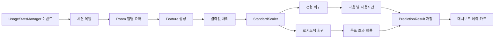

# HabitGuard Android

HabitGuard는 스마트폰 사용 습관을 분석하고, 다음 날 사용 시간을 예측하며, 사용자가 직접 승인한 제한 규칙으로 충동적인 앱 실행을 줄이도록 돕는 Android 네이티브 앱입니다.

이 프로젝트는 Kotlin + Jetpack Compose 기반의 Android 앱입니다. Flutter로 다시 작성한 프로젝트가 아니며, 서버 없이도 사용 기록 수집, 일별 특징 생성, 로컬 AI 추론, 예측 결과 저장, 대시보드 표시가 동작하는 local-first 구조를 목표로 합니다.

> 현재 AI 모델 범위: `source_type=synthetic`, `evaluation_scope=synthetic evaluation`  
> 앱은 실제 기기에서 수집한 사용 기록을 예측 입력으로 사용할 수 있지만, 현재 공개된 모델 성능 수치는 합성 데이터 평가 결과입니다. 실제 사용자 성능으로 과장하면 안 됩니다.


## 핵심 기능

| 영역 | 현재 구현 상태 |
| --- | --- |
| 사용 기록 수집 | 사용자가 Usage Access 권한을 허용하면 Android `UsageStatsManager`와 `UsageEvents`로 앱별 사용 메타데이터를 수집합니다. |
| 일별 집계 | Room DB에 총 사용시간, 야간 사용시간, 카테고리별 사용시간, 세션 수, 앱 실행 횟수, 데이터 품질 상태를 저장합니다. |
| 오프라인 AI | Python에서 Linear Regression과 Logistic Regression의 계수, 절편, scaler, feature 순서를 JSON으로 export하고 Kotlin에서 같은 수식을 계산합니다. |
| 예측 결과 저장 | WorkManager가 일별 집계 후 예측을 갱신하고, collecting-data 상태가 아닌 결과를 Room의 `prediction_result`에 저장합니다. |
| Guard / Mission | 사용자가 승인한 규칙에 한해 AccessibilityService가 제한 앱 진입을 감지하고 Lock/Mission 화면을 표시합니다. |
| 개인정보 경계 | 알림 본문, 화면 텍스트, 입력 문장은 읽거나 저장하지 않습니다. 예측 서버는 필요하지 않습니다. |

## 앱 화면

| 대시보드 | 목표 / 규칙 검토 | 리포트 |
| --- | --- | --- |
|  |  |  |

## AI 학습 및 예측 파이프라인


| 과제 | 선택된 모델 | 합성 데이터 평가 결과 |
| --- | --- | --- |
| 다음 날 총 스크린타임 예측 | `linear_regression` | MAE `18.1632`, RMSE `23.8108`, R2 `0.8774` |
| 다음 날 목표 초과 위험 분류 | `logistic_regression` | Accuracy `0.8611`, Macro F1 `0.8495`, 고위험 Recall `0.84` |

주요 산출물:

- `ai/phone_outputs/feature_schema.json`
- `ai/phone_outputs/android_inference_bundle.json`
- `app/src/main/assets/android_inference_bundle.json`
- `ai/phone_outputs/regression_metrics.json`
- `ai/phone_outputs/classification_metrics.json`
- `ai/phone_outputs/poster_assets/`

## 모델이 작동하는 방식



Android Kotlin 추론은 Python이 만든 validation fixture와 수학적으로 일치하는지 테스트합니다.

- 회귀 예측값 차이: `0.1분 이하`
- 분류 확률 차이: `0.001 이하`

## 혼동 행렬 분석


합성 평가 label은 `within_goal`과 `over_goal`입니다.

| 실제 / 예측 | within_goal | over_goal |
| --- | ---: | ---: |
| within_goal | 41 | 6 |
| over_goal | 4 | 21 |

해석:

- 실제 목표 초과일을 목표 초과로 맞춘 경우: `21`
- 목표 초과였지만 놓친 경우: `4`
- 목표 이내였지만 과위험으로 본 경우: `6`
- 고위험 Recall: `21 / (21 + 4) = 0.84`

즉, 합성 데이터 기준으로는 목표 초과 위험일을 비교적 잘 잡아냅니다. 다만 이 결과는 실제 사용자 성능이 아니라 학습·평가·Android export 파이프라인이 재현 가능하다는 근거입니다.

## 빌드와 테스트

```powershell
.\gradlew.bat --no-daemon :app:assembleDebug
.\gradlew.bat --no-daemon :app:testDebugUnitTest
.\gradlew.bat --no-daemon :app:lintDebug
python -m unittest tests\test_train_from_phone_csv.py
```

## 주요 문서

- [프로젝트 보고서](docs/HABITGUARD_REPORT.md)
- [프로젝트 감사](PROJECT_AUDIT.md)
- [포스터에 써도 되는 주장](POSTER_CLAIMS.md)
- [기술 리스크](TECH_RISKS.md)
- [데이터 사전](DATA_DICTIONARY.md)
- [보안 감사](SECURITY_AUDIT.md)
- [개인정보 아키텍처](PRIVACY_ARCHITECTURE.md)

## 현재 한계

- 현재 모델은 합성 데이터로 학습됐습니다.
- 실제 수집 데이터는 예측 입력으로 사용할 수 있지만, 실제 사용자 모델 성능은 아직 검증되지 않았습니다.
- 일반 Android 앱은 다른 앱을 OS 수준에서 완전히 차단할 수 없습니다. HabitGuard는 사용자 승인 기반의 사용 중단/미션 흐름입니다.
- Guard v2 전체 실제 기기 시나리오는 추가 검증이 필요합니다.
- `data/raw/`의 실제 휴대폰 export 파일은 공개 저장소에 커밋하지 않습니다.
