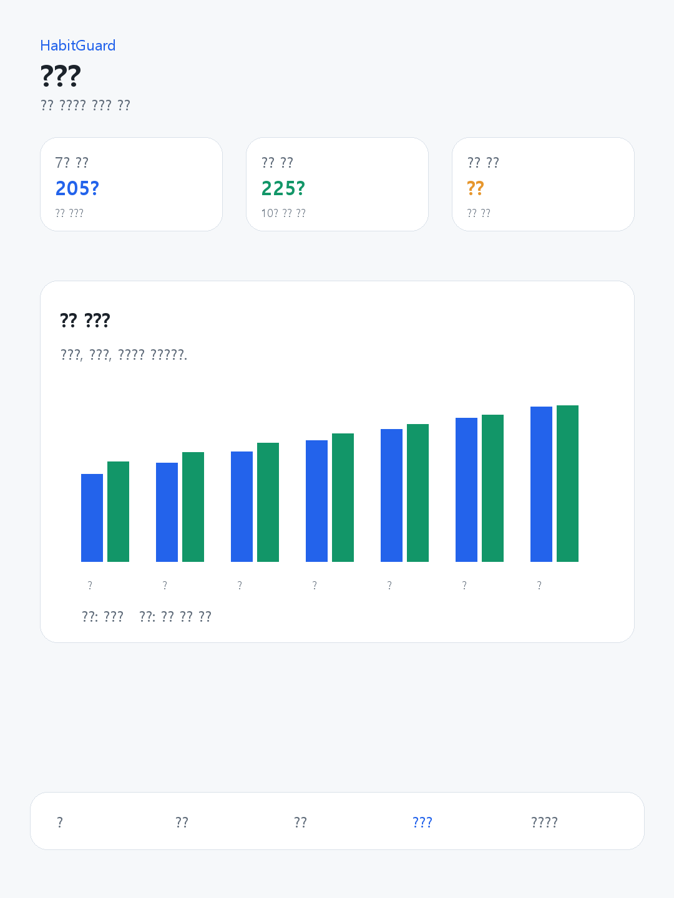
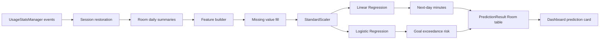

# HabitGuard Android

HabitGuard is a native Android Kotlin + Jetpack Compose app for understanding smartphone usage patterns and helping users set self-approved interruption rules.

The project is local-first: usage summaries, prediction inputs, local model inference, prediction results, goals, and mission logs are stored on the device. The current AI model is an offline JSON-bundle model exported from Python and executed in Kotlin.

> Current model scope: `source_type=synthetic`, `evaluation_scope=synthetic evaluation`. The app can use real collected usage summaries as input, but the published model metrics are not real-user performance claims.


## What It Does

| Area | Current implementation |
| --- | --- |
| Usage collection | Android `UsageStatsManager` and `UsageEvents` collect app-level usage metadata after the user grants Usage Access. |
| Daily summaries | Room stores total usage, night usage, category totals, sessions, app opens, and data-quality status. |
| Offline AI | Python exports Linear Regression and Logistic Regression math to `android_inference_bundle.json`; Kotlin runs the same scaler and coefficient calculations offline. |
| Prediction storage | WorkManager refreshes daily summaries and stores non-collecting prediction results in Room. |
| Guard flow | User-approved rules can trigger a Lock/Mission interruption flow through AccessibilityService foreground app detection. |
| Privacy boundary | Notification bodies, screen text, and typed input are not read or stored. Cloud prediction is not required. |

## Screens

| Dashboard | Goal / rule review | Report |
| --- | --- | --- |
|  |  |  |

## AI Pipeline


| Task | Current selected model | Synthetic evaluation |
| --- | --- | --- |
| Next-day total screen-time regression | `linear_regression` | MAE `18.1632`, RMSE `23.8108`, R2 `0.8774` |
| Goal-exceedance risk classification | `logistic_regression` | Accuracy `0.8611`, Macro F1 `0.8495`, high-risk recall `0.84` |

Artifacts:

- `ai/phone_outputs/feature_schema.json`
- `ai/phone_outputs/android_inference_bundle.json`
- `app/src/main/assets/android_inference_bundle.json`
- `ai/phone_outputs/regression_metrics.json`
- `ai/phone_outputs/classification_metrics.json`
- `ai/phone_outputs/poster_assets/`

## Model Explanation



Kotlin parity tests verify the Android inference result against a Python-generated fixture:

- Regression prediction difference: `<= 0.1` minute
- Classification probability difference: `<= 0.001`

## Confusion Matrix


Synthetic evaluation labels are `within_goal` and `over_goal`.

| Actual / Predicted | within_goal | over_goal |
| --- | ---: | ---: |
| within_goal | 41 | 6 |
| over_goal | 4 | 21 |

Interpretation: on the synthetic test split, the classifier catches most over-goal days (`21 / 25`, high-risk recall `0.84`) while still producing some false alarms (`6` within-goal days predicted as over-goal). This is useful as pipeline evidence, not proof of real-user accuracy.

## Build And Test

```powershell
.\gradlew.bat --no-daemon :app:assembleDebug
.\gradlew.bat --no-daemon :app:testDebugUnitTest
.\gradlew.bat --no-daemon :app:lintDebug
python -m unittest tests\test_train_from_phone_csv.py
```

## Documentation

- [Project report](docs/HABITGUARD_REPORT.md)
- [Project audit](PROJECT_AUDIT.md)
- [Poster claims](POSTER_CLAIMS.md)
- [Technical risks](TECH_RISKS.md)
- [Data dictionary](DATA_DICTIONARY.md)
- [Security audit](SECURITY_AUDIT.md)
- [Privacy architecture](PRIVACY_ARCHITECTURE.md)

## Important Limits

- The current model is trained on synthetic data only.
- Android consumer apps cannot truly disable every third-party app; HabitGuard uses a user-approved interruption and mission flow.
- Real-device Guard v2 scenarios still need complete manual verification.
- Do not commit private phone exports from `data/raw/`.
