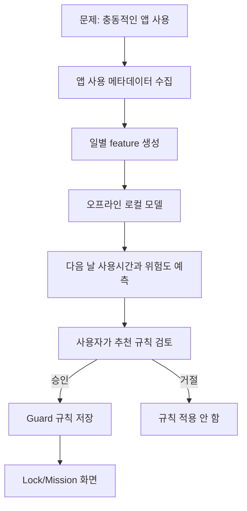
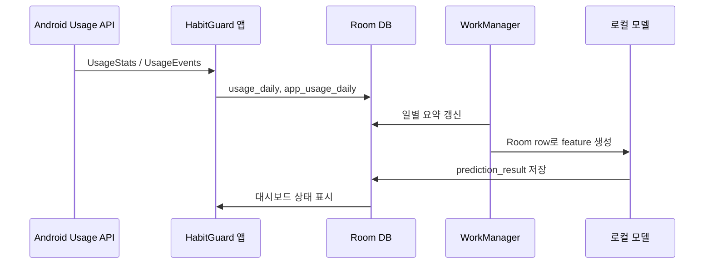
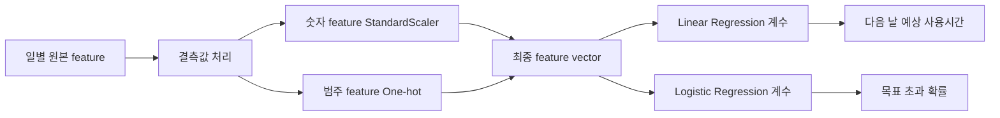

# HabitGuard 프로젝트 보고서

최종 갱신: 2026-06-26 KST

## 1. 프로젝트 요약

HabitGuard는 스마트폰 사용 습관 개선을 목표로 하는 Android-first 앱입니다. 앱별 사용 기록을 기기 안에서 수집하고, 일별 특징을 만들고, 오프라인 예측 모델을 실행한 뒤, 사용자가 직접 승인한 제한 규칙과 미션 화면으로 충동적인 앱 실행을 줄이도록 돕습니다.

이 프로젝트는 실제 Android 네이티브 Kotlin + Jetpack Compose 앱입니다. 서버가 없어도 사용 기록 수집, 일별 집계, AI 추론, 예측 결과 저장, 대시보드 표시가 동작하는 local-first 구조를 갖습니다.


## 2. 한눈에 보는 인포그래픽

| 단계 | 사용 기술 / 근거 | 결과물 |
| --- | --- | --- |
| 수집 | `UsageStatsManager`, `UsageEvents` | 앱 사용 시간, 야간 사용, 실행 횟수 |
| 집계 | `UsageEventAggregator`, Room DAO | `usage_daily`, `app_usage_daily` |
| 예측 | `android_inference_bundle.json`, Kotlin 로컬 모델 | 다음 날 사용시간, 목표 초과 확률 |
| 저장 | `PredictionResultEntity` | 로컬 예측 기록 |
| 안내 | Compose 대시보드, 규칙 검토 화면 | 측정값, 모델 출처, 한계 문구, 추천 |
| 개입 | AccessibilityService, LockActivity | 사용자 승인 기반 미션 흐름 |



## 3. 데이터 수집 파이프라인

HabitGuard는 Digital Wellbeing 내부 DB를 직접 읽지 않습니다. 사용자가 Usage Access 권한을 허용한 뒤 Android의 공식 `UsageStatsManager` API로 앱 사용 메타데이터를 읽습니다.



### 현재 로컬 DB 테이블

| 테이블 | 역할 |
| --- | --- |
| `usage_daily` | 날짜별 총 사용시간, 야간 사용, 카테고리별 사용, 세션 수, 데이터 품질 |
| `app_usage_daily` | 앱별 날짜별 사용 기록 |
| `prediction_result` | 로컬 예측 결과 |
| `restriction_rule` | 사용자가 승인한 제한 규칙 |
| `mission_log` | 미션 시도 기록 |
| `guard_event` | 제한 감지 및 우회 관련 이벤트 |
| `notification_daily` | 앱별 알림 개수만 저장, 알림 본문은 저장하지 않음 |

## 4. Feature Engineering

Python 학습 파이프라인과 Android Kotlin 추론은 `android_inference_bundle.json`에 저장된 동일한 feature 순서를 사용합니다.

주요 feature 그룹:

- 총 사용시간과 야간 사용시간
- 앱 실행 횟수와 사용 앱 수
- 가장 많이 사용한 앱의 사용시간
- 세션 길이 proxy
- 알림 개수와 실행당 알림 비율
- 최근 3일 / 7일 평균 사용시간
- 개인 목표 시간
- 카테고리별 사용시간: 영상, SNS, 게임, 브라우저, 생산성, 기타
- 요일과 주말 여부 one-hot feature

미래 정답이나 label은 feature에서 제외합니다.

- `target_next_day_minutes`
- `target_goal_exceeded`
- `goal_risk_label`
- `user_type_label`

## 5. 예측 모델 구조

현재 앱에 연결된 모델은 단순하고 설명 가능한 모델을 선택했습니다.

| 과제 | 모델 | 선택 이유 |
| --- | --- | --- |
| 다음 날 총 스크린타임 예측 | Linear Regression | 빠르고 설명 가능하며 계수로 Android export 가능 |
| 목표 초과 위험 분류 | Logistic Regression | 확률과 class label을 오프라인에서 계산 가능 |
| 사용자 유형 분류 | 보조 분석 모델 | 앱의 핵심 의사결정 모델로 직접 사용하지 않음 |



## 6. 합성 데이터 평가 결과

아래 수치는 합성 데이터 평가 결과입니다. 실제 사용자 성능으로 주장하면 안 됩니다.

| 지표 | 값 |
| --- | ---: |
| 회귀 MAE | 18.1632분 |
| 회귀 RMSE | 23.8108분 |
| 회귀 R2 | 0.8774 |
| 회귀 best baseline 대비 개선율 | 55.3482% |
| 분류 Accuracy | 0.8611 |
| 분류 Macro F1 | 0.8495 |
| 고위험 Recall | 0.84 |
| 다수 클래스 baseline 대비 개선율 | 115.0629% |


## 7. 혼동 행렬 분석


| 실제 / 예측 | within_goal | over_goal |
| --- | ---: | ---: |
| within_goal | 41 | 6 |
| over_goal | 4 | 21 |

분석:

- 목표 초과 위험일을 맞춘 경우: `21`
- 목표 초과였지만 놓친 경우: `4`
- 목표 이내였지만 위험으로 분류한 경우: `6`
- 고위험 Recall: `21 / (21 + 4) = 0.84`

습관 개선 앱에서는 위험일을 놓치는 것이 더 큰 문제일 수 있으므로, 어느 정도의 false alarm은 감수할 수 있습니다. 다만 이 판단은 합성 데이터 기준이며, 실제 사용자에게 일반화하려면 실제 export 데이터로 재학습과 재평가가 필요합니다.

## 8. Android 로컬 추론 방식

Android 앱은 Python `.joblib` 파일을 직접 읽지 않습니다. Python은 Android가 읽을 수 있는 JSON bundle을 export합니다.

포함 필드:

- `schema_version`
- `model_version`
- `trained_at`
- `source_type`
- `evaluation_scope`
- `feature_names`
- `missing_value_strategy`
- `imputer_values`
- `scaler_mean`
- `scaler_scale`
- `regression_model.intercept`
- `regression_model.coefficients`
- `classification_model.intercept`
- `classification_model.coefficients`
- `classification_model.classes`
- `classification_model.positive_class`
- `training_manifest_hash`

Kotlin의 `ModelBundleLoader`가 bundle schema를 검증하고, `TrainedLocalPredictionModel`이 동일한 수학식을 계산합니다.

동일성 테스트:

| 검증 항목 | 허용 오차 | 테스트 |
| --- | ---: | --- |
| 회귀 예측값 | 0.1분 이하 | `TrainedLocalPredictionModelTest` |
| 분류 확률 | 0.001 이하 | `TrainedLocalPredictionModelTest` |

## 9. 앱 화면 구성

| 분석 | 목표 입력 | 개인정보 / 설정 |
| --- | --- | --- |
|  |  |  |

## 10. 개인정보와 안전 원칙

HabitGuard는 local-first 원칙을 따릅니다.

- 원시 사용 요약은 Room DB에 로컬 저장합니다.
- 알림 본문은 저장하지 않습니다.
- AccessibilityService는 `canRetrieveWindowContent=false`로 설정되어 화면 내용이나 입력 문장을 읽지 않습니다.
- 예측은 서버 없이 동작합니다.
- 클라우드 동기화는 현재 예측에 필요하지 않습니다.
- 모델 결과만으로 제한 규칙을 자동 적용하지 않습니다.

## 11. 현재 한계

- 현재 모델은 합성 데이터로 학습됐습니다.
- 실제 수집 사용 기록은 추론 입력으로 사용할 수 있지만, 실제 사용자 모델 성능은 아직 검증되지 않았습니다.
- Android 일반 앱은 다른 앱을 OS 수준에서 완전히 차단할 수 없습니다.
- HabitGuard의 제한 기능은 사용자 승인 기반의 사용 중단/미션 흐름입니다.
- Guard v2 실제 기기 시나리오는 추가 수동 검증이 필요합니다.
- 공개 GitHub에는 `data/raw`의 실제 휴대폰 export를 올리면 안 됩니다.

## 12. 재현 방법

Android 확인:

```powershell
.\gradlew.bat --no-daemon :app:assembleDebug
.\gradlew.bat --no-daemon :app:testDebugUnitTest
.\gradlew.bat --no-daemon :app:lintDebug
```

Python ML 확인:

```powershell
python ai\train_from_phone_csv.py --output-dir ai\phone_outputs --update-android-asset
python -m unittest tests\test_train_from_phone_csv.py
```

주요 근거 문서:

- `PROJECT_AUDIT.md`
- `PROJECT_TODO.md`
- `POSTER_CLAIMS.md`
- `TECH_RISKS.md`
- `DATA_DICTIONARY.md`
- `MODEL_CARD.md`
