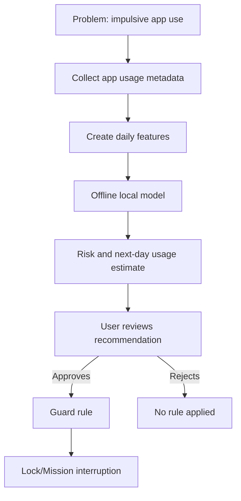
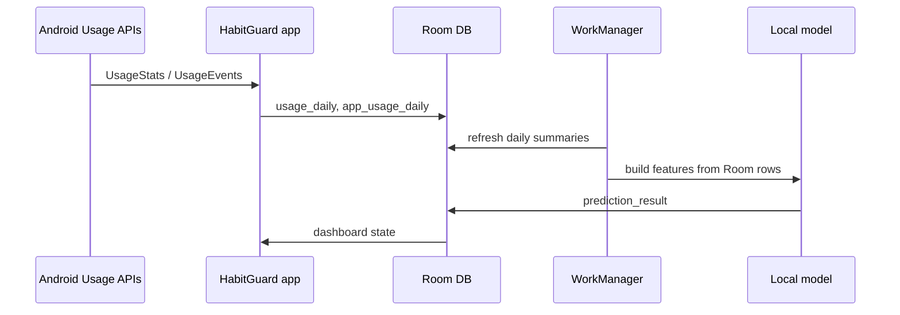
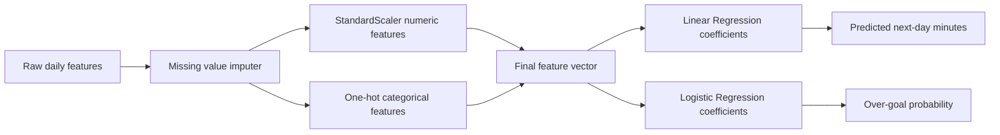
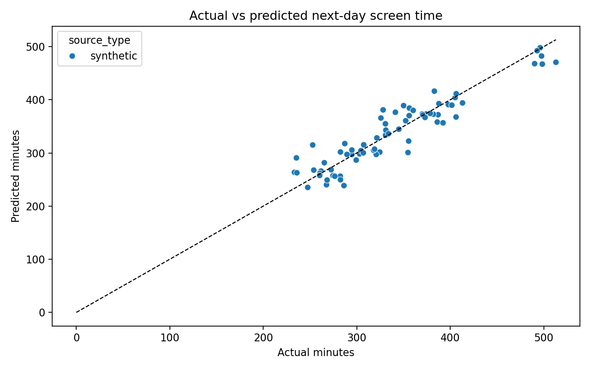
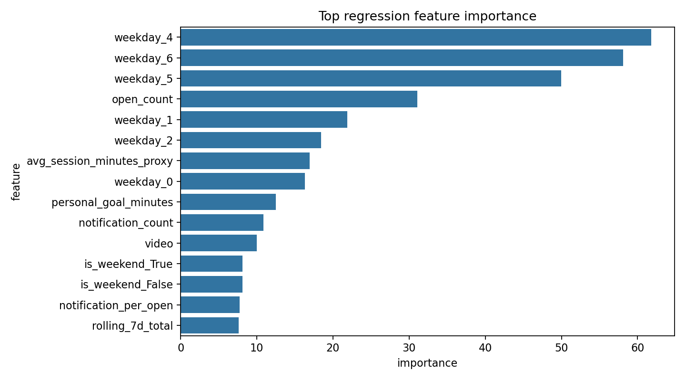
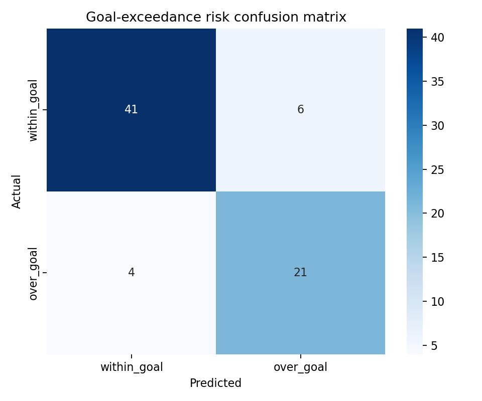
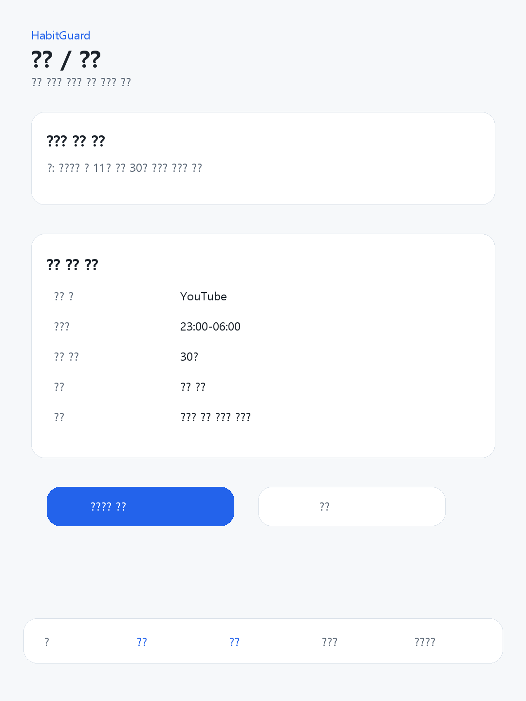
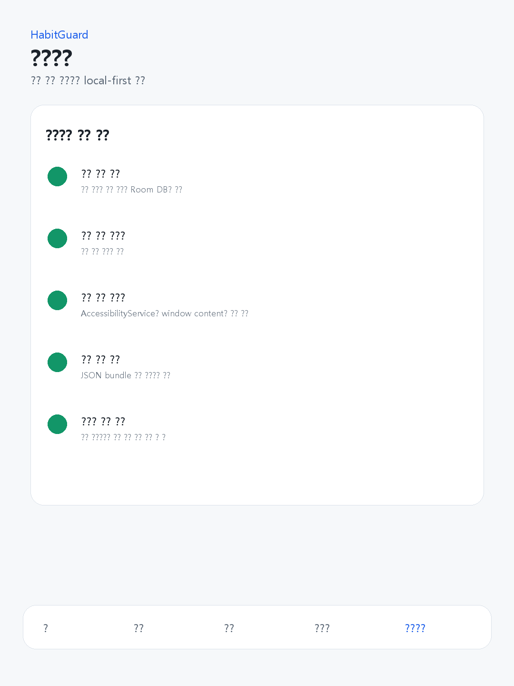

# HabitGuard Project Report

Last updated: 2026-06-26 KST

## 1. Project Summary

HabitGuard is an Android-first screen-time habit improvement app. It collects app-level usage metadata locally, builds daily features, runs offline prediction models, and helps users review self-approved interruption rules.

This is not a Flutter rewrite and not a server-first prototype. The current implementation is a native Kotlin + Jetpack Compose Android app with Room, WorkManager, UsageStatsManager, AccessibilityService, and a local JSON-bundle AI model.


## 2. One-Page Infographic

| Stage | Evidence | Output |
| --- | --- | --- |
| Collect | `UsageStatsManager`, `UsageEvents` | App usage minutes, night minutes, opens |
| Aggregate | `UsageEventAggregator`, Room DAOs | `usage_daily`, `app_usage_daily` |
| Predict | `android_inference_bundle.json`, Kotlin local model | Next-day minutes, over-goal probability |
| Store | `PredictionResultEntity` | Local prediction history |
| Guide | Compose dashboard and rule review | Measured values, model source, caveat, recommendation |
| Interrupt | AccessibilityService + LockActivity | User-approved mission flow |



## 3. Data Pipeline

HabitGuard does not read Digital Wellbeing's internal database. It uses Android's public `UsageStatsManager` API after the user grants Usage Access.



### Current local data tables

| Table | Purpose |
| --- | --- |
| `usage_daily` | Per-day total usage, night usage, category totals, sessions, data quality |
| `app_usage_daily` | Per-app daily usage rows |
| `prediction_result` | Stored local prediction summaries |
| `restriction_rule` | User-approved restriction rules |
| `mission_log` | Mission attempt history |
| `guard_event` | Guard flow events |
| `notification_daily` | Per-app notification counts only |

## 4. Feature Engineering

The Python and Kotlin paths share the same feature order through `android_inference_bundle.json`.

Core feature groups:

- Total and night usage minutes
- App open count and app count
- Top app minutes
- Session proxy features
- Notification count and notification-per-open
- Rolling 3-day and 7-day totals
- Personal goal minutes
- Category usage: video, SNS, game, browser, productivity, other
- Weekday and weekend one-hot features

Target columns are explicitly excluded from features:

- `target_next_day_minutes`
- `target_goal_exceeded`
- `goal_risk_label`
- `user_type_label`

## 5. Model Pipeline

The current selected models are intentionally simple and explainable:

| Task | Model | Reason |
| --- | --- | --- |
| Next-day total screen-time prediction | Linear Regression | Fast, explainable, easy to export as coefficients |
| Goal-exceedance risk | Logistic Regression | Produces probability and class label offline |
| User type classification | Auxiliary analysis only | Not used as the main app decision model |



## 6. Synthetic Evaluation Results

The following numbers are from synthetic evaluation only.

| Metric | Value |
| --- | ---: |
| Regression MAE | 18.1632 minutes |
| Regression RMSE | 23.8108 minutes |
| Regression R2 | 0.8774 |
| Regression improvement vs best baseline | 55.3482% |
| Classification accuracy | 0.8611 |
| Classification macro F1 | 0.8495 |
| High-risk recall | 0.84 |
| Classification improvement vs majority baseline | 115.0629% |





## 7. Confusion Matrix Analysis



| Actual / Predicted | within_goal | over_goal |
| --- | ---: | ---: |
| within_goal | 41 | 6 |
| over_goal | 4 | 21 |

Analysis:

- True positives for over-goal risk: `21`
- Missed over-goal days: `4`
- False alarms: `6`
- High-risk recall: `21 / (21 + 4) = 0.84`

This behavior is acceptable for a habit-support prototype because missing a high-risk day is more harmful than showing a cautious warning. However, these numbers are not real-user performance. They only prove the training/evaluation/export pipeline is reproducible.

## 8. Android Local Inference

The app does not load `.joblib` files. Python exports a platform-neutral JSON bundle:

- `schema_version`
- `model_version`
- `trained_at`
- `source_type`
- `evaluation_scope`
- `feature_names`
- `missing_value_strategy`
- `imputer_values`
- `scaler_mean`
- `scaler_scale`
- `regression_model.intercept`
- `regression_model.coefficients`
- `classification_model.intercept`
- `classification_model.coefficients`
- `classification_model.classes`
- `classification_model.positive_class`
- `training_manifest_hash`

Kotlin loads and validates this bundle with `ModelBundleLoader`, then computes the same math in `TrainedLocalPredictionModel`.

Parity tests:

| Check | Required tolerance | Current test |
| --- | ---: | --- |
| Regression prediction | <= 0.1 minute | `TrainedLocalPredictionModelTest` |
| Classification probability | <= 0.001 | `TrainedLocalPredictionModelTest` |

## 9. App Screens

| Analysis | Goal | Privacy |
| --- | --- | --- |
|  |  |  |

## 10. Privacy And Safety

HabitGuard uses a local-first data boundary:

- Raw usage summaries stay in Room.
- Notification body text is not stored.
- AccessibilityService is configured with `canRetrieveWindowContent=false`.
- Prediction requests do not need a server.
- Cloud sync is not required for local AI.
- Restriction rules are not auto-applied by model results.

## 11. Current Limitations

- The current model is trained on synthetic data.
- Real collected usage can feed inference, but real-user model performance is not proven.
- Android app interruption is not the same as OS-level app blocking.
- Full Guard v2 real-device scenarios still need manual evidence.
- GitHub/public releases must not include private `data/raw` phone exports.

## 12. Reproducibility

Run Android checks:

```powershell
.\gradlew.bat --no-daemon :app:assembleDebug
.\gradlew.bat --no-daemon :app:testDebugUnitTest
.\gradlew.bat --no-daemon :app:lintDebug
```

Run Python ML checks:

```powershell
python ai\train_from_phone_csv.py --output-dir ai\phone_outputs --update-android-asset
python -m unittest tests\test_train_from_phone_csv.py
```

Primary documentation:

- `PROJECT_AUDIT.md`
- `PROJECT_TODO.md`
- `POSTER_CLAIMS.md`
- `TECH_RISKS.md`
- `DATA_DICTIONARY.md`
- `MODEL_CARD.md`
